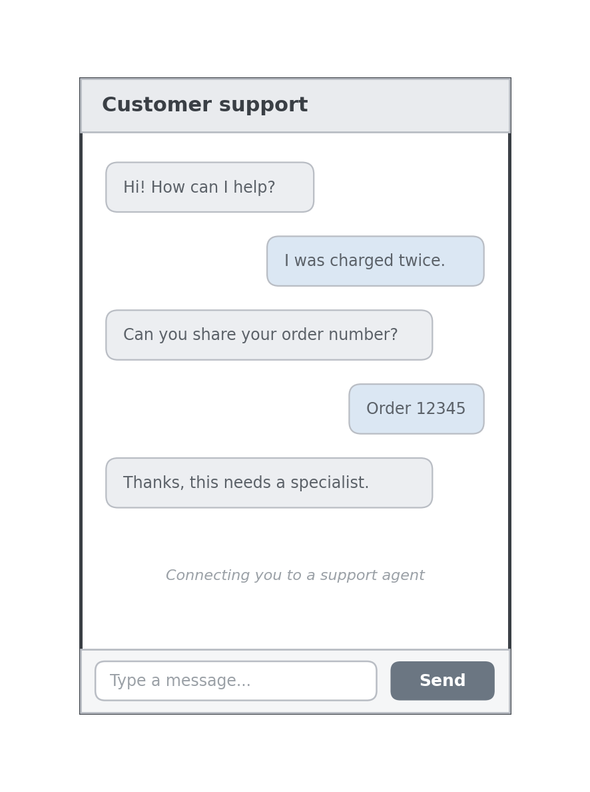
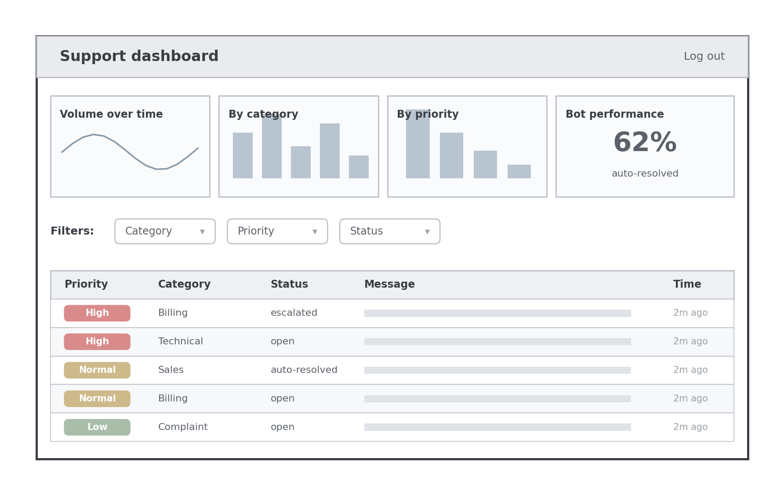

# WhoDis

> An AI customer support triage system that reads incoming tickets, works out what each one needs, handles the easy ones itself, and knows when to hand off to a human.

**Status:** in active development. The design is complete; implementation is underway.

## What it is

WhoDis is a self-hostable support assistant for businesses of any size. A customer asks a question; WhoDis reads it, classifies it, answers the routine cases directly, and routes the rest to the right team. A dashboard gives the support team a live view of what is coming in and how well the assistant is doing.

The motivation is accessibility. WhoDis is built around a small language model that runs on modest hardware, so a local shop with a basic website can run it on its own machine instead of paying for a hosted enterprise tool, while the same architecture is designed to scale up for larger teams.

**The name is a play on "new phone, who dis?", the stock reply to a text from an unknown number. That is the question WhoDis answers for every incoming ticket: who is this, and what do they need?**

## The idea

Large language models write fluent text but are historically unreliable at the decisions that move a task-oriented conversation forward: when to ask a clarifying question, when they have heard enough to act, and when to stop and hand off to a person. WhoDis separates these concerns. The language model handles wording, while a small, dedicated component owns the strategy: answer, ask, or escalate. Making that decision explicit, instead of hoping the model gets it right, is what lets the assistant escalate reliably rather than confidently guess.

## How it works

A message arrives at the web backend, which passes it to a separate inference service. The inference service classifies the message and decides whether to answer, ask, or escalate, and logs the prediction. The backend stores the resulting ticket, routes it to the right queue, and the dashboard reads it back for the team.

## Architecture

WhoDis is two cooperating services plus a frontend:

- **Application service** (React + Node.js + PostgreSQL): the chat window, the team dashboard, ticket and queue data, and routing.
- **Inference service** (Spring Boot + MongoDB): the small language model and the control component that decides answer / ask / escalate, plus the prediction logs.

Each service runs in its own Docker container. Kubernetes manifests describe how the inference service would scale independently.

## Tech stack

- **Frontend:** React
- **Backend:** Node.js (Express)
- **Inference service:** Spring Boot (Java)
- **Databases:** PostgreSQL (operational data), MongoDB (prediction logs)
- **Model:** a small, self-hostable language model
- **Infrastructure:** Docker, Docker Compose, Kubernetes

## Screens

(Placeholder: wireframes for now, real screenshots once the UI is built.)

## Getting started

> Setup instructions will be added as the build progresses.

Planned: clone the repository, then start the full stack with Docker Compose.

## Roadmap

- [x] System design and architecture
- [ ] Walking skeleton (end to end, message to stored ticket)
- [ ] Classification and the answer / ask / escalate logic
- [ ] Routing and queues
- [ ] Dashboard and charts
- [ ] Containerization and local Kubernetes
- [ ] Final README with live screenshots and setup steps

## Notes

Personal portfolio project. Built to demonstrate an end-to-end, self-hostable support system and an uncertainty-aware approach to when an assistant should act, ask, or hand off.